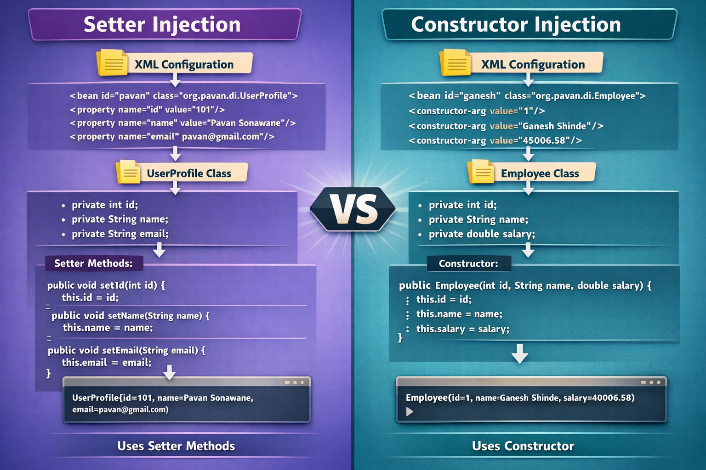

# 🚀 Spring Dependency Injection (DI)

A hands-on project demonstrating **Spring Dependency Injection (DI)** concepts using real-world examples.

---

## 💡 What This Covers

This code demonstrates:

* ✅ Setter Injection
* ✅ Constructor Injection
* ✅ Injecting Objects (Bean to Bean)
* ✅ Loose Coupling using Spring IoC

---

## ⚙️ How It Works

---

## 📌 Conclusion

👉 *Spring Dependency Injection allows us to define and manage objects through configuration instead of creating them
manually in code. This makes the application easier to modify, as we can change values or switch objects without
updating the Java code. It helps keep the code clean, flexible, and easier to maintain*
